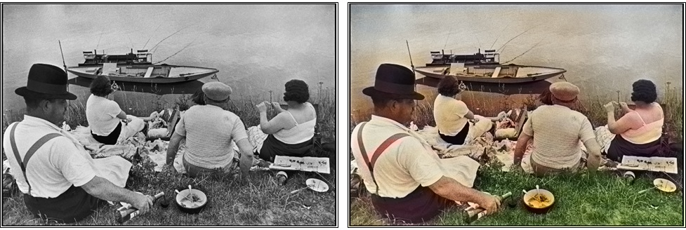
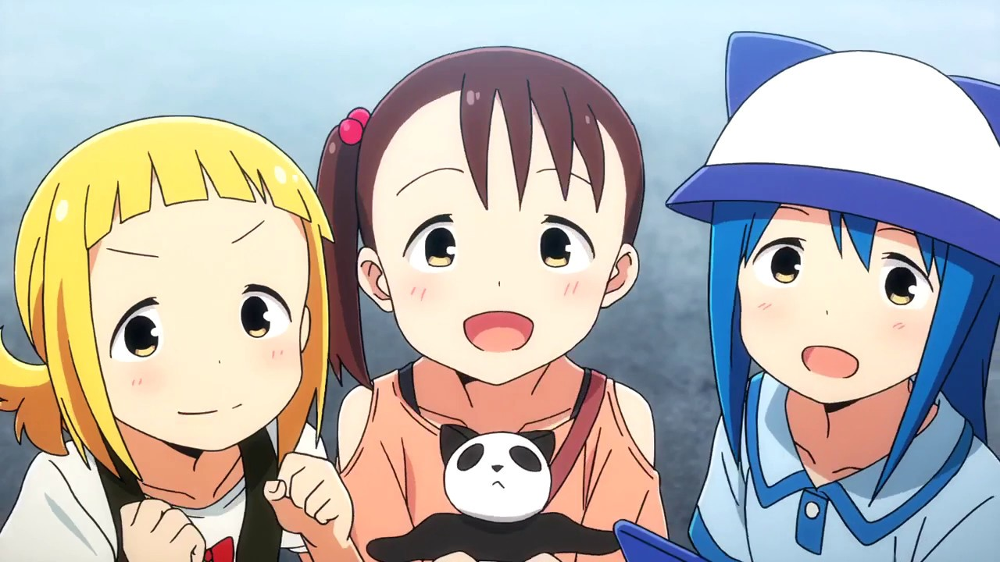
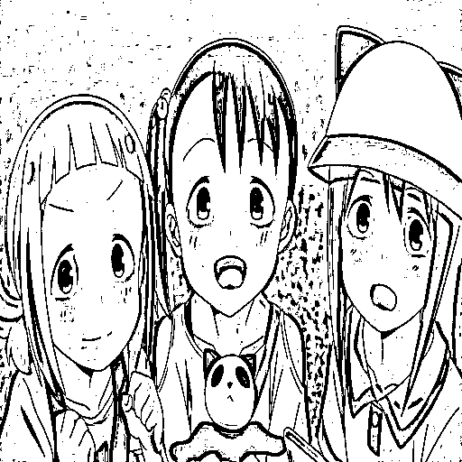
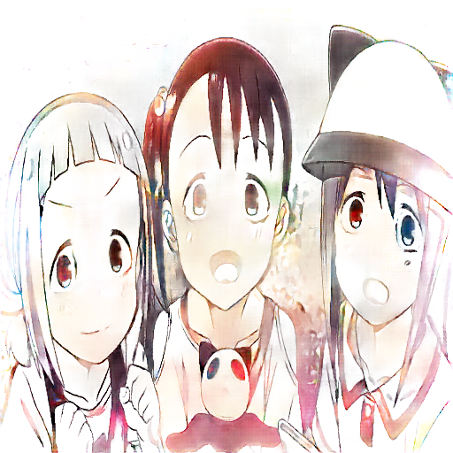
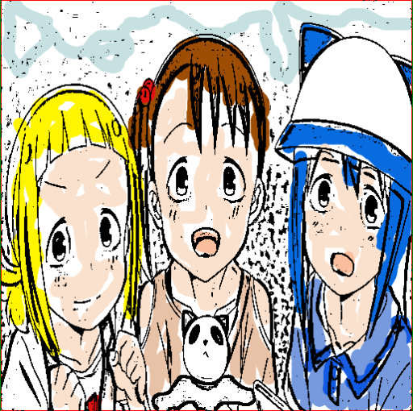
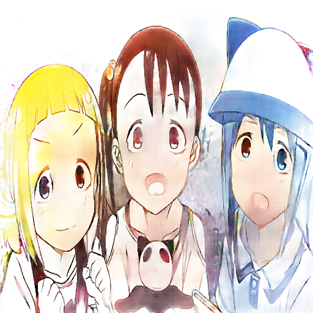

# Comparisons

The grading of artwork is widely considered to be a subjective process. Thus, any conclusions listed here, whether by this author or any other, should be taken with a grain of salt. Specifically, this section should function less as an attempt to objectively compare the results of different image colorization methods, and instead as a showcase of the different methods. Of course, any obvious advantages and disadvantages will be listed, but if the results of one method should appeal to any readers more than any other methods, they should feel free to disregard any supposed overall benefits proffered by other methods, if they are so inclined.

That said, here is a comparison of various methods of colorizing sketches and drawings using neural networks:

## Convolutional Neural Network Results

*(Image Source: [1])*

*{other example WIP}*
*(Image Credit: [Sushio / Trigger Inc.](https://imgur.com/gallery/nWKo4))*

The CNN approach indeed succeeds at applying color to grayscale images. When properly trained, this method is certainly capable of producing some plausible, and even impressive-looking, results. There are a few drawbacks, however. One is a lack of color coherence: simply put, the CNN may make several different choices for similar features in the same image. This can be seen most easily in the photographic example included above, by studying the network’s choice of colors for the people in Fig. %. Next is the previously-mentioned failure mode of CNNs, in that results can sometimes be blurry or grayish. Blurred colors are strongly evident in all of these examples, including how the colors “bleed” outside of the character’s outline in Fig. %, and how the sepia-brown color washes across much of the top-middle of the middle of the photograph in Fig. %. Graying is also evident in the photograph, as the entire top edge of Fig. % is gray or uncolored.

It is likely possible to achieve even more satisfactory results with a CNN by more carefully training an implementation to a dataset (that is suitable for colorizing sketches and drawings, for instance). However, these issues are evident (albeit not guaranteed) even on the photographic example, which was produced on such a carefully-trained CNN.

## Conditional Generative Adversarial Network Results

Original Image (Credit: Silver Link / Sentai Filmworks)

Input | Output
------|-------
 Input Linemap |  Output Colorized (No Hints)
 Input with Color Hints |  Output Colorized (with Hints)

The cGAN approach produces vivid but often semi-blurry colors. Almost all cGAN examples that were tested produced colored images that resembled watercolor paintings: Selected color tones were often muted, and colors blended smoothly with one another - sometimes even across obvious outlines or borders. These results do illustrate one failure mode: An inconsistency of choices similar to CNNs (in that similar features in the same image may be colored differently), although the effect of this is often much more limited than with the CNN approach, making cGAN perhaps the more successful in this respect. Additionally, as predicted in the literature, cGANS do not seem as susceptible to grayish results or to producing large single-colored (or uncolored) areas, as was seen in the CNN approach.

## Analysis

Both of the methods are capable of producing plausible results. However, the cGAN method seems to have a higher overall degree of success. Even ignoring the fact that the cGAN method is less susceptible to the common failure symptoms of the CNN method (grays and/or blurs) for coloring features within an image, the cGAN is more reliable about processing images in the first place. With the CNN, not every image that was attempted produced any colored output at all. If input is provided that it does not like (for instance, that differs too far from any of the images the network was trained on, perhaps?), it partially or completely fails to color the output - an instance of the “gray” failure mode. As such, the cGAN is the more reliable result for almost always producing some kind of color in its output. Taken alongside the fact that cGANs seem to more reliably color all features of an image as well (unlike the CNNs which also frequently fail to color features or entire image sections), and it means that cGANs are simply the more sophisticated approach.

Of course, it isn’t that CNNs *can’t* be used to effectively colorize images. Although this author was unable to reproduce any, several examples on the website of the CNN implementation that was used which look particularly convincing. However, it seems clear that cGANs are simply more suited for the task of colorizing images than CNNs are.

## Performance and Implementation Notes

Running and training a neural network can be difficult. Of the reviewed implementations and many more, few were truly easy to get to run; many were also not easily trained to the point of usability. Due to time constraints, it was not possible to properly evaluate the difficulty of running and training every method. Several methods were considered for evaluation, notably the AC-GAN and CycleGAN methods, but were disconsidered from inclusion due to the difficulty of running them, the difficulty of obtaining ideal datasets to train them on, and the lack of an available and accessible online implementation. In particular, the AC-GAN seems to be capable of producing even better output than the cGAN method, but demonstrating and evaluating it effectively was impossible. 

The CycleGAN approach produces very convincing output for certain domains, but it remains to be seen if it can be successfully adapted to colorizing images. Example images created from CycleGANs used for this exist, but there does not appear to be any public implementation of this.

## References

 1. *Colorful Image Colorization.* Zhang, Richard, et al., 2016, [richzhang.github.io/colorization](https://richzhang.github.io/colorization/). Accessed 8 Mar. 2018.
