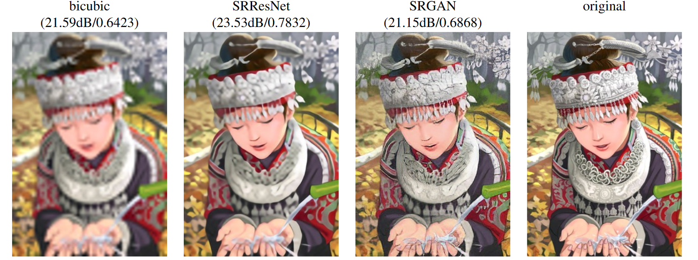

# Other Computerized Artwork Processes

Image classification and image colorization are not the only image processing or artwork generating techniques to which computers and computer learning have been applied. This section contains a quick overview of a different process to which neural networks have recently been applied.

## Image Upscaling

The act of upscaling a digital image to a larger resolution is difficult, in that (contrary to a physical photograph, which has detail embedded in it at a microscopic level and thus which can always be upscaled easily) small-resolution digital images have no detail to be gained by upsizing: What you see before scaling is all that there is, and so the usual methods of upscaling have nothing to gain and much to lose (via the blur or pixel duplication caused by common methods).

Typically, computers use several different algorithms to upscale images. These include nearest-neighbor (wherein destination pixels take on the color of the nearest-fit source pixel), bilinear or bicubic (which more smoothly interpolate between neighboring values than in nearest-neighbor), and anti-aliasing filters (which blur overly-sharp edges). However, recently neural networks have been used to attempt to intelligently extrapolate additional detail from the source images being upscaled. As there are a great many uses for a method of extracting additional detail from a low-resolution image, having neural networks which can accomplish this task better than non-neural methods would be highly useful.

One implementation uses a Generative Adversarial Network to upscale images. (More details to come in a future draft.) This Super-Resolution GAN (SR-GAN) includes an adversarial loss component in addition to a perceptual loss component, which was specially designed to allow the network to concern itself with minimizing content loss in perceptual terms rather than technical terms - that is, compute the loss based on a visual model that can determine how close two images would appear to the human eye[1].

*(Image Source: [1])*

An implementation of this method which used Python, TensorFlow and TensorLayer was considered[2]. Even in extreme use cases, its output appears remarkably good compared to the best non-neural approaches. In the above example, the left image is a non-neural method, the second example is a non-perceptual neural method, the third image is the output of the SR-GAN, and the fourth is the original image before 4x downscaling. This shows the effectiveness of using neural networks in image upscaling. Although of course not entirely accurate, the SR-GAN is able to extract detail much more effectively than the non-neural bicubic approach, and while not all of the detail that it produces is accurate, it is certainly plausible. Although such inaccuracies may be undesireable for certain applications, this may surely be less of a problem when used for artwork purposes.

If neural networks can be applied effectively to image upscaling,as demonstrated above, then there are surely even more artwork- and image-processing-related tasks that can also be improved with the addition of neural networks. 

## References

 1. Ledig, Christian, et al. "Photo-Realistic Single Image Super-Resolution Using a Generative Adversarial Network." *Cornell University Library*, [arXiv:1609.04802](https://arxiv.org/abs/1609.04802). Accessed 8 Mar. 2018.
 2. *Photo-Realistic Single Image Super-Resolution Using a Generative Adversarial Network.* 2018, [github.com/tensorlayer/srgan](https://github.com/tensorlayer/srgan). Accessed 8 Mar. 2018.
